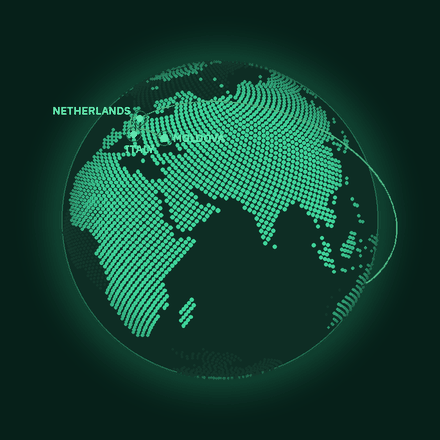
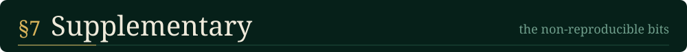
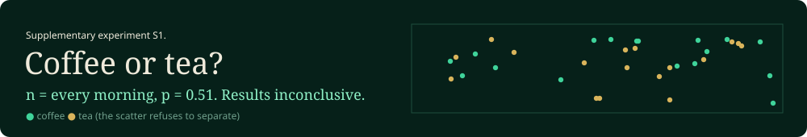

<!-- Adel Lis, GitHub profile. Version: Neural lab. Assets live in /assets/lab. -->

  
  

> I am a computational scientist in training, reading for an **MSc in Computational Science** at the University of Amsterdam and Vrije Universiteit Amsterdam, after a **BSc in Artificial Intelligence** at VU and a semester of Computer Science at the University of Queensland.
>
> My work sits where mathematics meets machines: *gradient-free optimisation*, *quantised deep learning*, *high-performance computing* and *agentic LLM systems*. The current direction of research is low-level systems programming in C++, in pursuit of the engineering behind low-latency trading.
>
> **Keywords:** evolution strategies · mathematical programming · computer vision · HPC · LLM agents · C++20

*Moldova → Italy → the Netherlands → Australia → the Netherlands.* &nbsp;Sample size: 4 countries. More data required.

🍜 &nbsp;*Field studies* in every cuisine I can find &nbsp;&nbsp;·&nbsp;&nbsp; 🎬 &nbsp;*Qualitative research* in cinema &nbsp;&nbsp;·&nbsp;&nbsp; ⚙️ &nbsp;*Current focus:* C++ low-level systems programming

<!-- CLOSING SECTION (CV + talk-with-me demo). To enable: replace YOUR_CV_LINK and
     YOUR_TALK_WITH_ME_LINK below, then delete the two lines that contain only the comment markers. -->
<!--

-->
