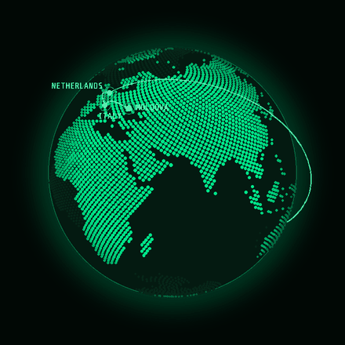

<!-- Adel Lis, GitHub profile. Version: Emerald matrix. Assets live in /assets/matrix. -->

<div align="center">


<p align="center">
  <a href="mailto:adel.lis.work@gmail.com"></a>
  <a href="https://www.linkedin.com/in/adel-lis-6887532a8/"></a>
</p>

</div>


```bash
$ cat ~/.profile
export NAME="Adel Lis"
export DEGREE="MSc Computational Science (UvA × VU Amsterdam)"
export PREVIOUS="BSc Artificial Intelligence (VU), exchange @ UQ Brisbane"
export BASE="Leiden, NL"
export STACK="optimisation, HPC, quantised deep learning, LLM agents"
export FOCUS="C++ low-level systems programming"
export TARGET="quant dev | high-frequency trading | swe"
```


<a href="https://github.com/Adel-Lis/eggroll-detector-tuning"></a>

<a href="https://github.com/Adel-Lis/RouteGate"></a>

<a href="https://github.com/Adel-Lis/stem-agent"></a>


<a href="https://github.com/Adel-Lis/multi_agent_market_simulator"></a>


<div align="center">



`traceroute`: &nbsp;1 &nbsp;moldova &nbsp;→&nbsp; 2 &nbsp;italy &nbsp;→&nbsp; 3 &nbsp;netherlands &nbsp;→&nbsp; 4 &nbsp;australia &nbsp;→&nbsp; 5 &nbsp;netherlands &nbsp;&nbsp;`* * * more hops pending`

</div>





<div align="center">

`$ ls ~/hobbies` &nbsp;→&nbsp; 🍜 `new_cuisines/` &nbsp;🎬 `movies/` &nbsp;⚙️ `cpp_low_level/ (currently open)`

</div>

<!-- CLOSING SECTION (CV + talk-with-me demo). To enable: replace YOUR_CV_LINK and
     YOUR_TALK_WITH_ME_LINK below, then delete the two lines that contain only the comment markers. -->
<!--


<p align="center">
<a href="YOUR_CV_LINK"></a>
<a href="YOUR_TALK_WITH_ME_LINK"></a>
</p>

-->
