<!-- Adel Lis, GitHub profile. Main version: poster. Other personalities: README.lab.md, README.matrix.md, README.quant.md -->

<a href="mailto:adel.lis.work@gmail.com">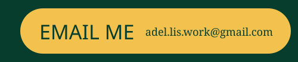</a><a href="https://www.linkedin.com/in/adel-lis-6887532a8/">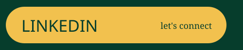</a>

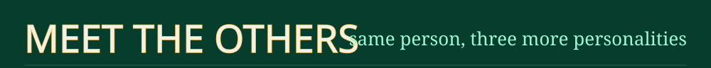
<a href="https://github.com/Adel-Lis/Adel-Lis/blob/main/README.lab.md">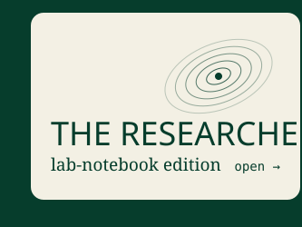</a><a href="https://github.com/Adel-Lis/Adel-Lis/blob/main/README.matrix.md">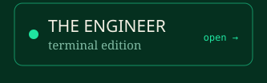</a><a href="https://github.com/Adel-Lis/Adel-Lis/blob/main/README.quant.md">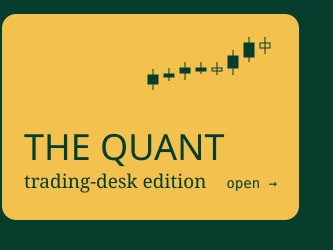</a>
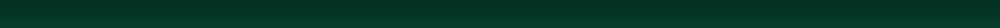
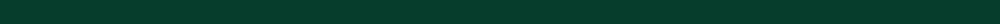
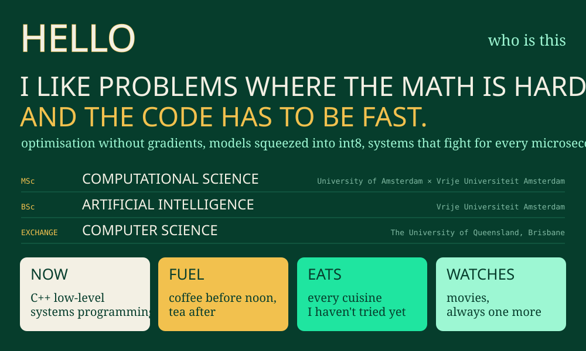

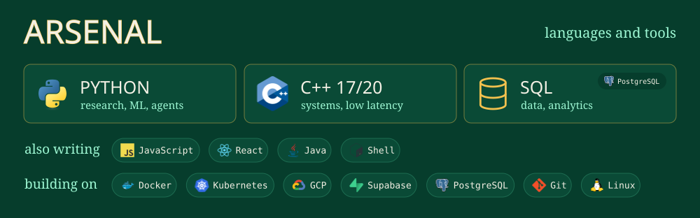

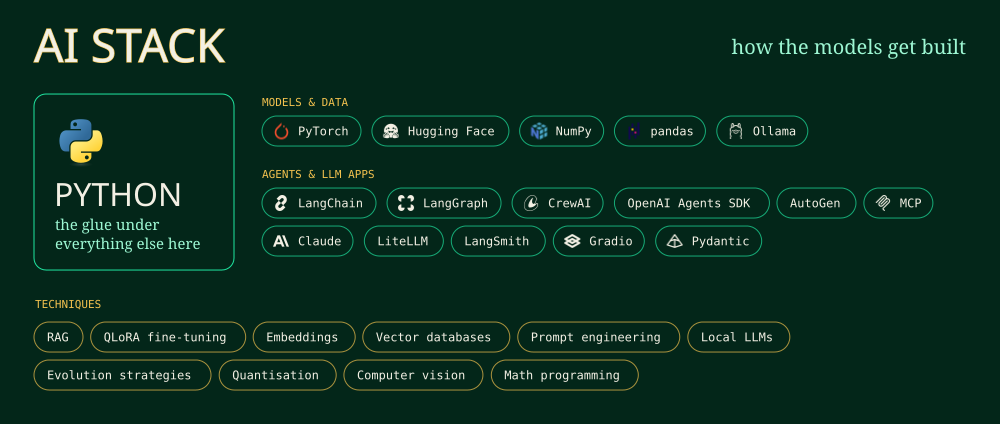
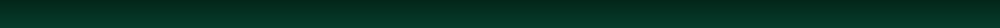

<!-- CLOSING SECTION (CV + talk-with-me demo). To enable: replace YOUR_CV_LINK and YOUR_TALK_WITH_ME_LINK,
     then delete the two lines that contain only the comment markers. -->
<!--

-->
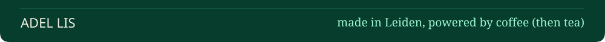

