<!-- Adel Lis, GitHub profile. Version: Retro poster. Assets live in /assets/poster. -->

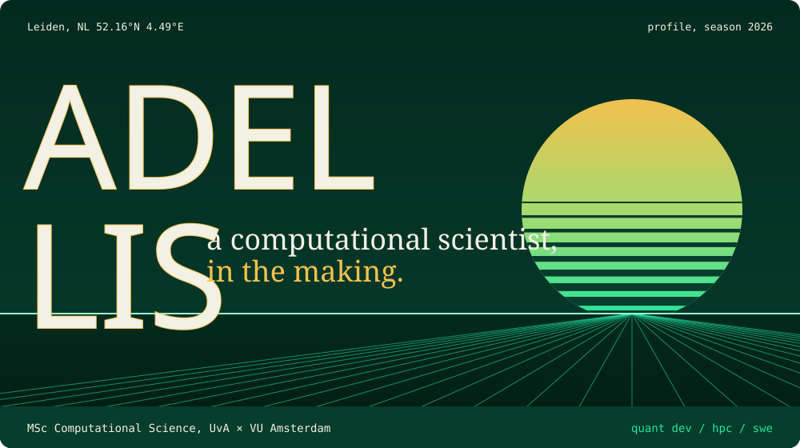

  
  

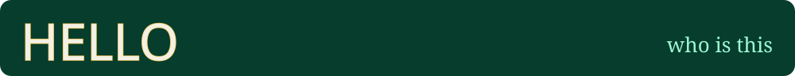

### Computational scientist, in the making.

**MSc Computational Science** at UvA × VU Amsterdam. **BSc Artificial Intelligence** at VU. One semester of Computer Science at the University of Queensland.

I like problems where the math is hard and the code has to be fast: optimisation without gradients, models squeezed into int8, systems that fight for every microsecond. Right now I'm going deep on **low-level systems programming in C++**.

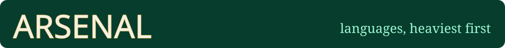

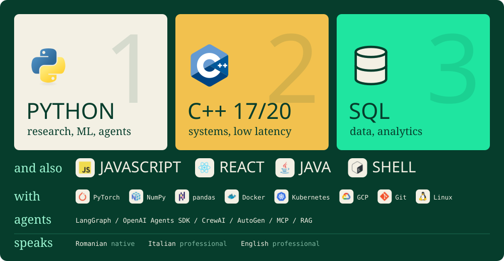

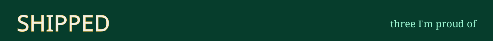

<a href="https://github.com/Adel-Lis/eggroll-detector-tuning">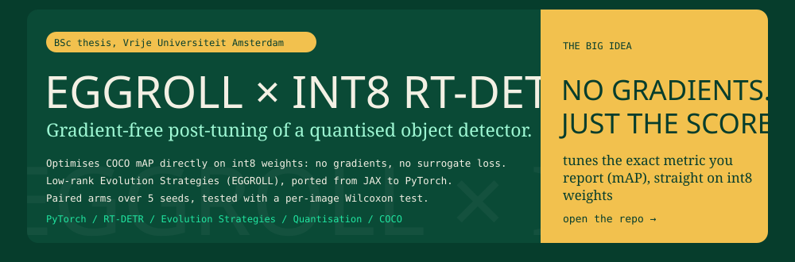</a>

<a href="https://github.com/Adel-Lis/RouteGate">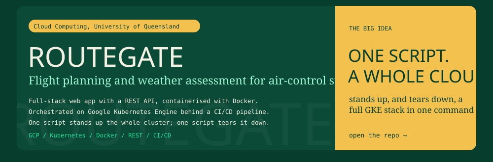</a>

<a href="https://github.com/Adel-Lis/stem-agent">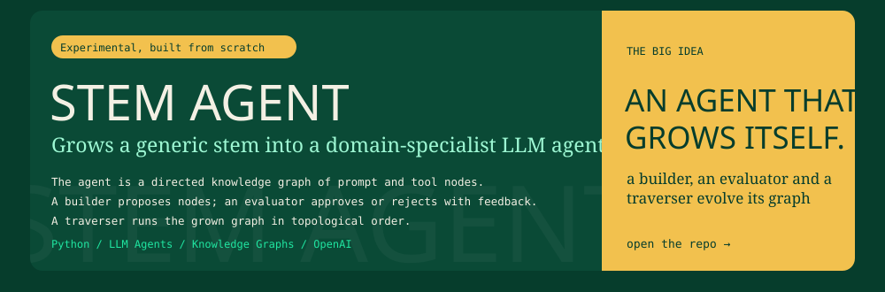</a>

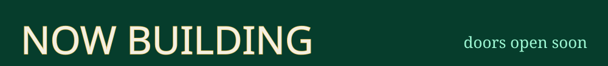

<a href="https://github.com/Adel-Lis/multi_agent_market_simulator">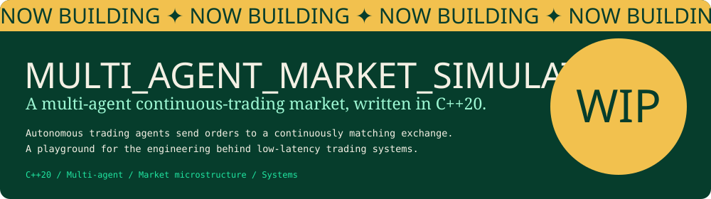</a>

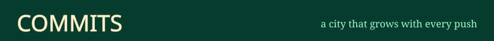

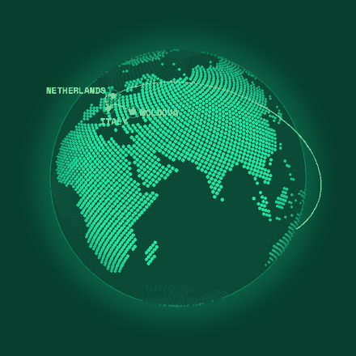

**MOLDOVA → ITALY → NETHERLANDS → AUSTRALIA → NETHERLANDS** &nbsp;·&nbsp; *world tour still in progress*

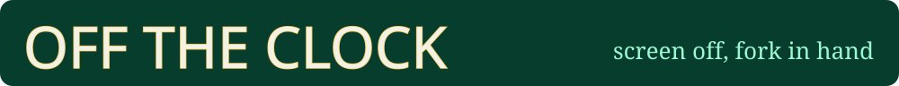

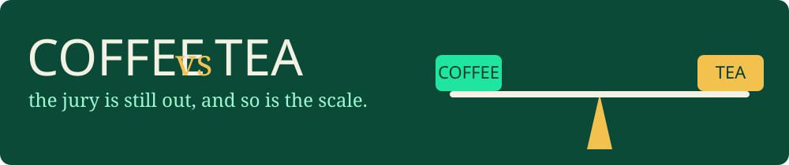

🍜 &nbsp;**Food:** hunting down cuisines I haven't tried yet &nbsp;&nbsp;·&nbsp;&nbsp; 🎬 &nbsp;**Movies:** always one more &nbsp;&nbsp;·&nbsp;&nbsp; ⚙️ &nbsp;**Now:** C++ low-level systems programming

<!-- CLOSING SECTION (CV + talk-with-me demo). To enable: replace YOUR_CV_LINK and
     YOUR_TALK_WITH_ME_LINK below, then delete the two lines that contain only the comment markers. -->
<!--
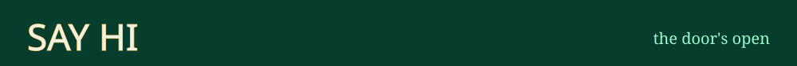

<a href="YOUR_TALK_WITH_ME_LINK">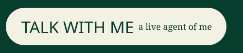</a>

-->
