<!-- Adel Lis, GitHub profile. Version: Quant terminal. Main version: README.md (poster). -->


<a href="mailto:adel.lis.work@gmail.com">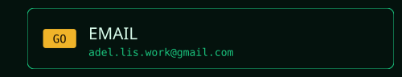</a><a href="https://www.linkedin.com/in/adel-lis-6887532a8/">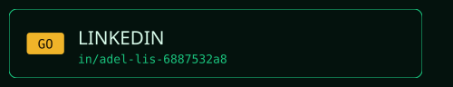</a>
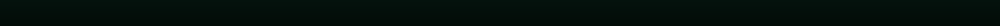
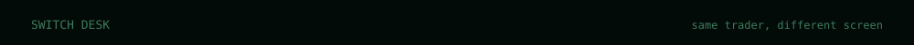
<a href="https://github.com/Adel-Lis/Adel-Lis/blob/main/README.md">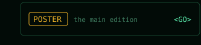</a><a href="https://github.com/Adel-Lis/Adel-Lis/blob/main/README.lab.md">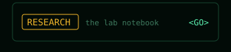</a><a href="https://github.com/Adel-Lis/Adel-Lis/blob/main/README.matrix.md">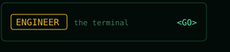</a>
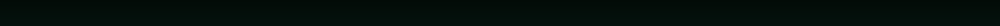
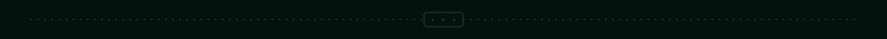
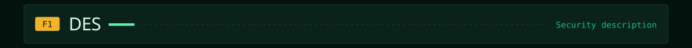
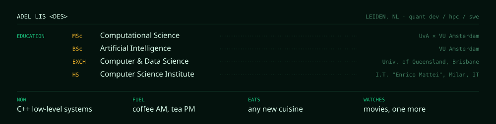

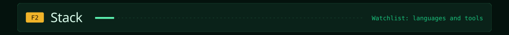
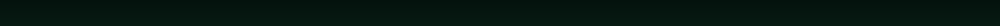
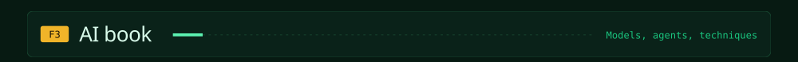
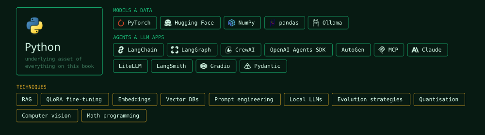
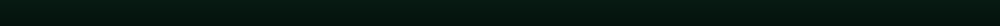

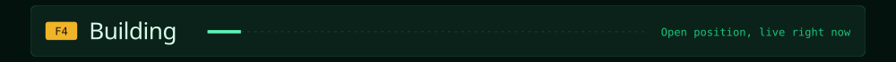
<a href="https://github.com/Adel-Lis/multi_agent_market_simulator">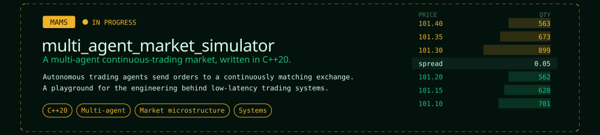</a>

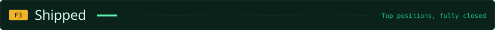
<a href="https://github.com/Adel-Lis/eggroll-detector-tuning"></a>
<a href="https://github.com/Adel-Lis/RouteGate"></a>
<a href="https://github.com/Adel-Lis/stem-agent"></a>

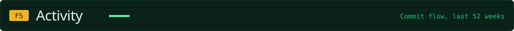

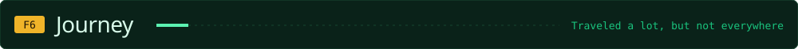
<!-- CLOSING SECTION (CV + talk-with-me demo). To enable: replace YOUR_CV_LINK and YOUR_TALK_WITH_ME_LINK,
     then delete the two lines that contain only the comment markers. -->
<!--
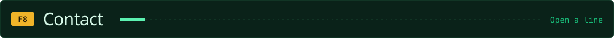
<a href="YOUR_CV_LINK">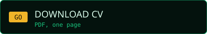</a><a href="YOUR_TALK_WITH_ME_LINK">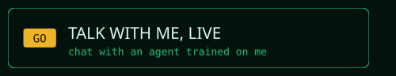</a>
-->
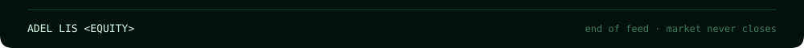

