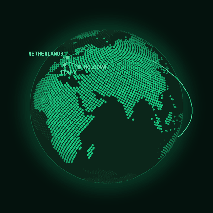
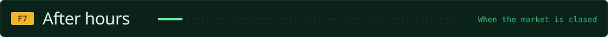
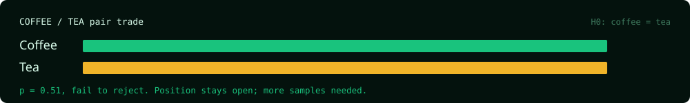

<!-- Adel Lis, GitHub profile. Version: Quant terminal. Assets live in /assets/quant. -->

<div align="center">


<p align="center">
  <a href="mailto:adel.lis.work@gmail.com"></a>
  <a href="https://www.linkedin.com/in/adel-lis-6887532a8/"></a>
</p>

</div>


```text
ADEL LIS   <DES>                                          LEIDEN, NL
────────────────────────────────────────────────────────────────────
EDUCATION   MSc Computational Science ...... UvA × VU Amsterdam
            BSc Artificial Intelligence .... VU Amsterdam
            Exchange, Computer Science ..... Univ. of Queensland
EDGE        gradient-free optimisation, quantised deep learning,
            high-performance computing, agentic LLM systems
FOCUS       C++ low-level systems programming
TARGET      quant dev  /  high-frequency trading  /  SWE
```


<a href="https://github.com/Adel-Lis/eggroll-detector-tuning"></a>

<a href="https://github.com/Adel-Lis/RouteGate"></a>

<a href="https://github.com/Adel-Lis/stem-agent"></a>


<a href="https://github.com/Adel-Lis/multi_agent_market_simulator"></a>


<div align="center">



`MD` → `IT` → `NL` → `AU` → `NL`   ·   next stop: pending order

</div>





<div align="center">

🍜 &nbsp;Always opening a position in a new cuisine &nbsp;&nbsp;·&nbsp;&nbsp; 🎬 &nbsp;Long on good movies &nbsp;&nbsp;·&nbsp;&nbsp; ⚙️ &nbsp;Studying: C++ low-level systems programming

</div>

<!-- CLOSING SECTION (CV + talk-with-me demo). To enable: replace YOUR_CV_LINK and
     YOUR_TALK_WITH_ME_LINK below, then delete the two lines that contain only the comment markers. -->
<!--


<p align="center">
<a href="YOUR_CV_LINK"></a>
<a href="YOUR_TALK_WITH_ME_LINK"></a>
</p>

-->
